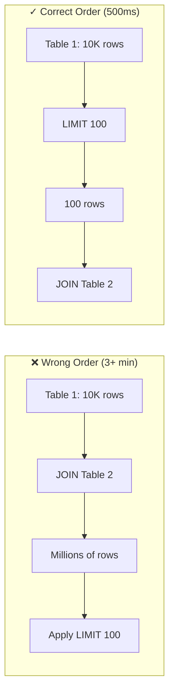
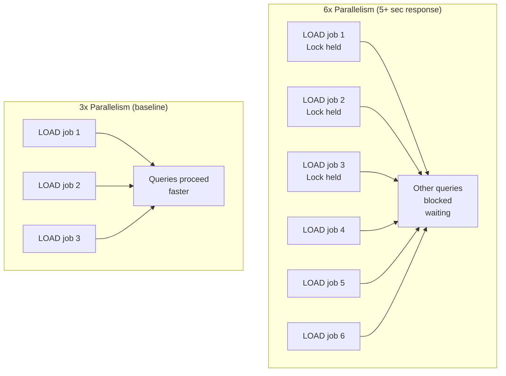
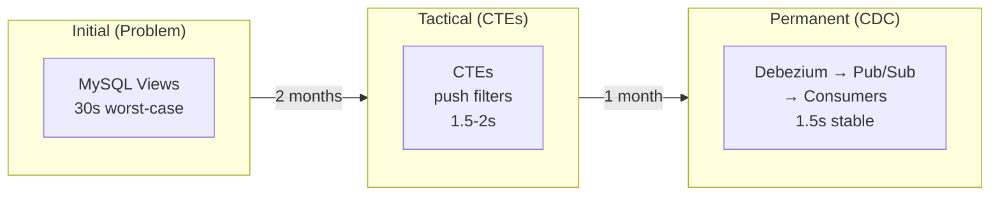
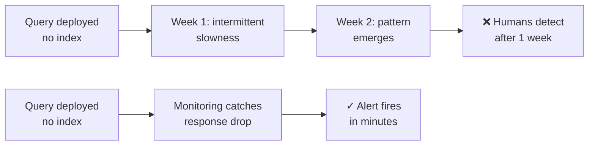
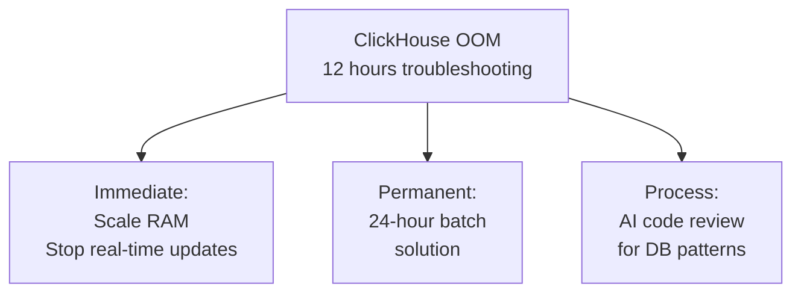
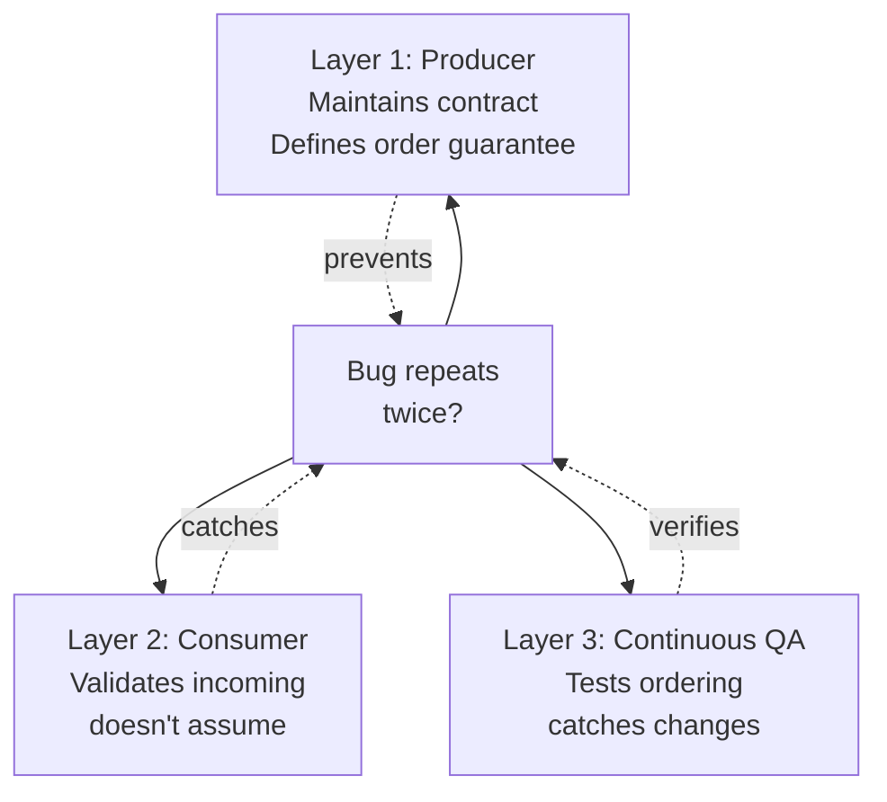
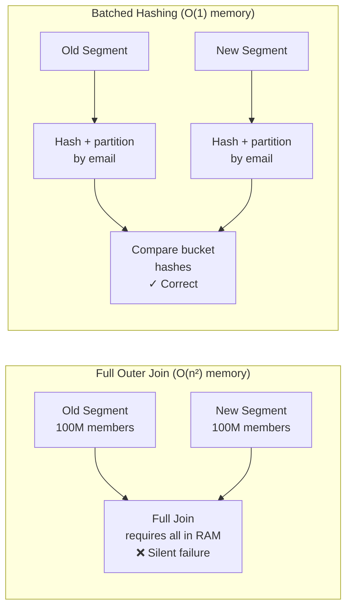
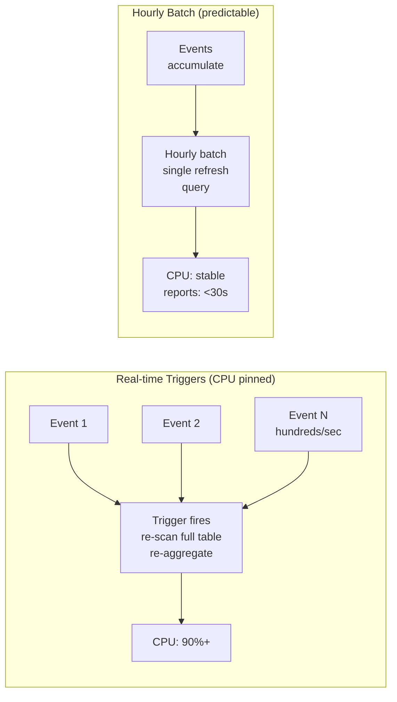
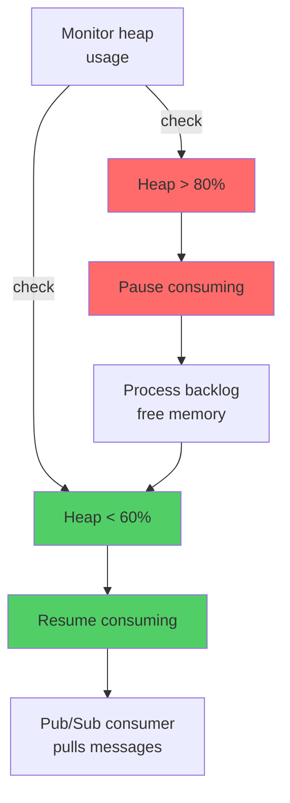

# Image Prompts & Diagrams

## Hero Image Prompts (1 per article)

Generate these via ChatGPT/DALL-E. Use these exact prompts for consistency. All images should be:
- Abstract/editorial technical illustration style
- No real logos, no people, no text in the image
- Dark/light theme neutral (use white background)
- ~1200x600px (Medium standard)

### Incident 1: Query Shape, Not Tuning

**Prompt:** Abstract illustration of data flow bottleneck. Show a narrow funnel on the left (representing millions of rows being joined), then a valve or constraint in the middle, opening into a wide stream on the right (representing the correct query order). Use cool blues and grays. Technical, minimal style. No text.

**File name:** `01-query-shape-hero.png`

---

### Incident 2: Production Lock Contention

**Prompt:** Isometric view of a database cylinder with multiple colored threads/arrows surrounding it, all converging at a single lock point. The threads appear blocked/stalled, waiting. Use reds and oranges for the blocked threads, grays for the database. Minimal line art style.

**File name:** `02-lock-contention-hero.png`

---

### Incident 3: The Problem Nobody Asked About

**Prompt:** Split-screen editorial illustration. Left side: products disappearing into a gray void (representing 24-hour staleness). Right side: same products flowing continuously in real-time, with small pulse/wave indicators. Use warm greens on the right, cool grays on the left. Emphasize the time dimension.

**File name:** `03-real-time-recs-hero.png`

---

### Incident 4: Views to Debezium CDC

**Prompt:** Transformation diagram: left side shows a tangled web of connections (representing MySQL views joining millions of rows), middle shows a breaking point/transition, right side shows clean, separated layers with directed arrows (representing Debezium → Pub/Sub → purpose-shaped consumers). Use purples and teals. Emphasize the architectural shift.

**File name:** `04-views-to-cdc-hero.png`

---

### Incident 5: Missing Index, Missing Process

**Prompt:** Timeline illustration with three phases: first phase shows a search icon with a magnifying glass over a large database (full scan), middle phase shows a stopwatch with a fast needle (after index), third phase shows a feedback loop/cycle icon (monitoring). Use blues and oranges. Emphasize process improvement.

**File name:** `05-missing-index-hero.png`

---

### Incident 6: Christmas Eve Clickhouse

**Prompt:** Calendar showing December 24th highlighted in red, with a server/database icon above it, surrounded by escalating pressure indicators (concentric circles, rising graph, stress waves). The icon appears strained. Use reds and dark oranges. Convey urgency and pressure.

**File name:** `06-christmas-crisis-hero.png`

---

### Incident 7: The Same Bug Twice

**Prompt:** Circular diagram showing a loop: "Bug A" → "Fix" → "Different system" → "Same Bug A appears" → back to start. Show three layers around it: top layer (producer), middle (consumer), bottom (continuous QA). Use warning yellows and oranges. Emphasize the loop/pattern.

**File name:** `07-repeated-pattern-hero.png`

---

### Incident 8: Silent Failure

**Prompt:** Dark abstract illustration: on the left, a large tangled knot (representing memory explosion/join operation), shrinking through the center via a funnel shape into small, ordered buckets on the right (representing batched hashing). Use dark purples transitioning to bright teals. Emphasize elegance of the solution.

**File name:** `08-silent-failure-hero.png`

---

### Incident 9: Materialized Views Gotcha

**Prompt:** Illustration of a database table with multiple triggers firing simultaneously (shown as lightning bolts), causing cascading CPU load (represented by stacked/piling blocks above). Bottom half shows the same table with a single, clean refresh cycle (one arrow, one time period). Use reds (overload) transitioning to greens (resolution).

**File name:** `09-materialized-views-hero.png`

---

### Incident 10: Backpressure as a Pattern

**Prompt:** Illustration of a water/flow analogy: left side shows a valve at 100% open with water/data rushing through at high pressure, center shows a valve with flow control (opening/closing cycles), right side shows smooth, regulated flow. Use blues and teals. Include small pod/container icons. Convey feedback loops.

**File name:** `10-backpressure-hero.png`

---

## Inline Diagrams (Mermaid Source)

Diagrams for the technical turning point in each article. Generate these via mermaid.live and export as PNG/SVG.

### Incident 1: Query Execution Order

**Placeholder in article:** `[DIAGRAM: Query Execution Order — Before/After]`

**Mermaid source:**

---

### Incident 2: Lock Contention Cascade

**Placeholder in article:** `[DIAGRAM: MySQL Lock Contention — 6 parallelism vs 3]`

**Mermaid source:**

---

### Incident 4: Architecture Evolution

**Placeholder in article:** `[DIAGRAM: Views → CTEs → Debezium]`

**Mermaid source:**

---

### Incident 5: Monitoring Gap

**Placeholder in article:** `[DIAGRAM: From Missing Index to Monitoring]`

**Mermaid source:**

---

### Incident 6: Crisis Response Layers

**Placeholder in article:** `[DIAGRAM: Christmas Crisis Response]`

**Mermaid source:**

---

### Incident 7: Three-Layer Fix

**Placeholder in article:** `[DIAGRAM: Ordering Validation Layers]`

**Mermaid source:**

---

### Incident 8: Batched Hashing Solution

**Placeholder in article:** `[DIAGRAM: From Full Join to Bucketed Hashing]`

**Mermaid source:**

---

### Incident 9: Materialized Views at Scale

**Placeholder in article:** `[DIAGRAM: Real-time Triggers → Hourly Batch]`

**Mermaid source:**

---

### Incident 10: Backpressure Pattern

**Placeholder in article:** `[DIAGRAM: Pause/Resume Feedback Loop]`

**Mermaid source:**

---

## Instructions

1. **Hero images:** Copy the prompt from above into ChatGPT or DALL-E. Generate. Save as PNG in medium-drafts/ with the specified filename.
2. **Diagrams:** Copy the Mermaid source code. Paste into mermaid.live. Render. Export as PNG or SVG. Save in medium-drafts/ with incident number prefix (e.g., `01-query-execution-order.png`).
3. **Article placeholders:** When drafting each article, leave a placeholder comment like `[DIAGRAM: Query Execution Order — Before/After]` at the point where the diagram should appear. Replace with the actual image filename when ready.
4. **Batch generation:** You can generate all 10 hero images at once (they don't have dependencies). Generate diagrams one per incident as you draft that article.

---

## File Naming Convention

All images stored in: `/home/udhayakumar/projects/udhayakumar.com/medium-drafts/`

Pattern: `NN-descriptive-name.{png|svg}`
- `NN` = incident number (01–10)
- Examples: `01-query-shape-hero.png`, `01-query-execution-order.png`
